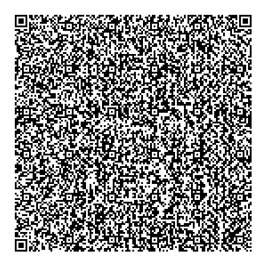
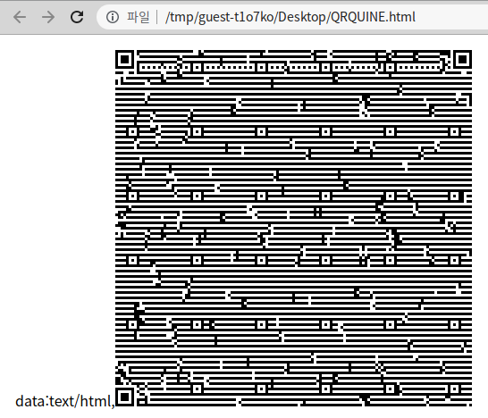

    
**콰인**은 별 다른 입력 없이, 자기 자신의 소스코드를 출력하는 메타 프로그램[^1] 중 하나입니다.[^2]   
시스템 파일 읽기나 외부 라이브러리를 사용하지 않고 자기 자신의 소스코드를 출력해야하기 때문에, 초보자가 작성하기 쉽지 않은 소스 코드중 하나입니다.    
## 1. 일단 작성하기    
모든것 이전에 일단 콰인 프로그램을 하나 작성하며 설명하겠습니다.<br><br>
**Source Code**
```c
#include <stdio.h>
int main(){
    printf("#include <stdio.h>\nint main(){\n\tprintf();\n\treturn 0;\n}");
    return 0;
}
```
**Output**
```c
#include <stdio.h>
int main(){
    printf();
    return 0;
}
```
시작이 좋습니다! `printf` 내부의 문자열 외엔 모든것을 작성했습니다. 하지만, 다른말로 말하면 콰인에 대해서 아무것도 진행되지 않았습니다.   
우선 이렇게 계속 `printf`의 형식 문자열(format)에 작성한다면, 콰인을 작성할 수 없으므로. 다음부터는 문자열 변수를 활용하겠습니다.
* * *
**Source Code**
```c
#include <stdio.h>
int main(){
  char CODE[] = "#include <stdio.h>\nint main(){\n\tchar CODE[] = \"\";\n\tprintf(\"%s\", CODE);\n\treturn 0;\n}";
  printf("%s", CODE);
  return 0;
}
```
**Output**
```c
#include <stdio.h>
int main(){
        char CODE[] = "";
        printf("%s", CODE);
        return 0;
}
```
이전 코드에서 문자열 `CODE`를 추가했습니다!   
하지만 출력 3번째 줄인 `char CODE[] = ""` 부분에서의 코드 수정이 어려워 보입니다.
어떻게 해야 `CODE` 내부에 `CODE`를 넣을 수 있을까요?
* * *
**Source Code**
```c
#include <stdio.h>
int main(){
    char CODE[] = "#include <stdio.h>\nint main(){\n\tchar CODE[] = \"%s\"\n\tprintf(CODE, CODE);\n\treturn 0;\n}";
    printf(CODE, CODE);
    return 0;
}
```
**Output**
```c
#include <stdio.h>
int main(){
    char CODE[] = "#include <stdio.h>
int main(){
    char CODE[] = "%s"
    printf(CODE, CODE);
    return 0;
}"
    printf(CODE, CODE);
    return 0;
}
```
물론 방법은 있습니다! `printf`의 형식문자열로 `CODE`를 사용하고,    
인자(parameter)에도 `CODE`를 사용해, `char CODE[] = "%s"` 의 `%s`에 CODE를 할당합니다.    
그러면 실행 결과를 실행 시키면 어떻게 될까요?
```
main.c: In function ‘main’:
main.c:3:19: warning: missing terminating " character
    3 |     char CODE[] = "#include <stdio.h>
      |                   ^
main.c:3:19: error: missing terminating " character
    3 |     char CODE[] = "#include <stdio.h>
      |                   ^~~~~~~~~~~~~~~~~~~
main.c:4:1: error: expected expression before ‘int’
    4 | int main(){
      | ^~~
main.c:8:2: warning: missing terminating " character
    8 | }"
      |  ^
main.c:8:2: error: missing terminating " character
```
음... 여러가지 에러가 나옵니다. 에러들을 종합해보면 전체적으로 2가지 에러가 있습니다.    
* 코드 중간에 줄바꿈이 생겨 컴파일 에러 발생.  
* `CODE` 선언 도중에 `"`가 있어서 문자열 선언이 중간에 중단됨.


이것을 어떻게 해결해야될까요?    
* * *
**Source Code**
```c
#include <stdio.h>
int main(){
    char CODE[] = "#include <stdio.h>%cint main(){%c%cchar CODE[] = %c%s%c;%c%cprintf(CODE, 10, 10, 9, 34, CODE, 34, 10, 9, 10, 9, 10);%c%creturn 0;%c}";
    printf(CODE, 10, 10, 9, 34, CODE, 34, 10, 9, 10, 9, 10);
    return 0;
}
```
**Output**
```c
#include <stdio.h>
int main(){
    char CODE[] = "#include <stdio.h>%cint main(){%c%cchar CODE[] = %c%s%c;%c%cprintf(CODE, 10, 10, 9, 34, CODE, 34, 10, 9, 10, 9, 10);%c%creturn 0;%c}";
    printf(CODE, 10, 10, 9, 34, CODE, 34, 10, 9, 10, 9, 10);
    return 0;
}
```
정답은 이스케이프 문자를 모두 아스키코드표를 이용하여 정수로 변환하는것입니다.    
`\n`을 `10`으로. `\t`를 `9`로. `"`를 `34`로 변환하여 이스케이프 문자 대신 완전히 동일한 역할을 하는 아스키 코드로 변경합니다.    
이로써 C언어를 사용한 콰인을 작성해봤습니다.   
## 2. 여러 이상한 콰인들    
위에서 C언어로 콰인을 작성했는데, 다른 언어들도 콰인을 가지고 있을까요?
콰인은 튜링 완전한 (그리고 모든 문자열 출력이 가능한) 모든 언어에서 구현이 가능합니다[^3]. 그래서 콰인은 [**여러가지 언어**](https://rosettacode.org/wiki/Quine)로 작성되고 있습니다.   
이러한 콰인의 특성 덕에, 인터넷에는 괴상한 콰인들이 돌아다니고 있는데, 그중 일부를 소개하겠습니다.    
### 2.1 콰인 크리스마스    
```ruby
 %;';;X=   %q(x=1;                                                     z="%c"%
 32;eval   %w(w=N=                   Merry                             =128;r=
 z*79+$/; ;p=open"                  /                                  dev/dsp
  ","w"rescue$_;/                  /                                   ;eval"s
   rand(%s)"%$*[    d=0];a=[];s=(r+z+%    (%;';;X=#{z*    3}%q(#{X});e val(X))
     +r*=23).l      ines.map{|l|l.chop+  r};t=proc{|y|s  [y][x-1,w].sca n(/\S
   /){s[y+1][m=x    -1+$`  .size  ,1]==           z&&a<  <[$&,m,        y,s[y
  ][m]=$/]};y};t[   23];f  =(0..  1071)   .map{|i|c,x,y   =a.shuffle!.  pop;s
 [y][x]=z ;[794-46  .03*i  **0.4  +y/k=  (3+ra    nd*w=          3)/9,[t
 [t[y]-1   ],x,c],  (0..y  /k).m  ap{[y  -=k,0.5+x+=k*r  and*2-k,?*]}]} ;"|ii
 xCG40_|   CK8&d9B  ix0,B  J?B?G  ^K9CG   CJ|ii>Ci?9CV;   =*-*.sEA.2gA  w>dc=
  :     `:z:J>      s      9QvA:>      J      taaA>`      :      @AP;Fa     c
  y   =Anm|?Bdqr    h    ?<CDJCD<IU    <    DuCJ>:d_C?    h    ?<CWC:'.'+   r
  9  A.*. '>| =*-   *   .:9i 9A> :JC   s   :Q> :>9 CJA=   g   `;C i9A >M".  b
 yt  es{|c|a+=([%  [+.  5$2-'30&)"/:  (7%  !*][c%19].or  d]*  [47,23,11][4  -c
 /1   9]<     <3   3).   *c/     95   +1}   ;$     ><<   (T=   "%     q\x   7e
  '    #{e="\x1    b [    "}H#{e}J    # {    e}?25")+    " l    ";863.do    w
   n to(0){|i|b=r +   [ "'"*25]*2*"_ (   c )_2010_@mame t   t er,@hirekoke "
    ;f.map{ |j,x,v     |i<j&&( y,x,c=     v.pop| |x;x<0|     |x>78| |b[x+y.
   to_i*80]=0<i&&i<   40??#:c)};($><<(   i>0?e+"H":T+"h")   +b).flush;(p)?4.
   times{N. times{v   =8;4.tim es{|l|t   =a[l*N* 9+d/N%11   52];t>3 3&&v+=(d
    *0.11*4**(t/24     .0-l%3))%8<=>4     };d+=1;p<<[16*     v].pack("C*")}
      ;p.flush}:         sleep(0.1)         };puts)*""         ;);eval(X)
'''''''''''''''''''''''''_(c)_2010_@mametter,@hirekoke'''''''''''''''''''''''''
```
루비로 작성된 [**이 콰인**](http://mamememo.blogspot.com/2010/12/merry-quine-mas-2010.html)은 X-mas라는 글자를 들고있는 눈사람을 표현한 아스키 아트로 보입니다.    
하지만 이 코드를 실행시키면...?    
    
눈이 내리는 애니메이션이 포함된 콰인이 재생됩니다...!!   
### 2.2 QR코드 콰인    
    
이 [**QR코드**](https://www.quaxio.com/qrquine/)는 뭘까요? 한번 스캔해봅시다.    
```html
data:text/html,<body style=padding:9><canvas id=C><script>function P(r,c,v){I[A*r+c]=v;return!(v&&C.getContext('2d').fillRect(c*3,r*3,3,3))}function S(i,j){for(r=O;r<8;r++)for(c=O;c<8;c++)j+c>O&&j+c<A&&P(i+r,j+c,0<r&&(r<7&&!(c%6))||((c+1)%8&&!(r%6)||1<r&&(r<5&&(1<c&&c<5))))}function N(a,b){if(a[L]<b[L])return a;o=a[0]/b[0];for(i=0;i<b[L];a[i++]^=z){m=b[i];n=o;for(z=0;m;n>255&&(n^=285))m&1&&(z^=n),n<<=1,m>>=1;}a.shift();return N(a,b)}C.height=C.width=(A=133)*3;I=[];X=O=-1;L='length';S(0,0);S(A-7,0);S(i=0,A-7);for(B=[6,30,54,78,102,126];i<6;i++)for(j=0;j<6;j++)if(!I[A*B[i]+B[j]])for(r=-2;r<3;r++)for(c=-2;c<3;c++)P(B[i]+r,B[j]+c,r&&!(r%2)||c&&!(c%2)||!r&&!c);for(i=8;i<A-8;P(6,i++,j))j=!(i%2),P(i,6,j);for(i=0;i<15;i++)j=29427>>i&1,i<6&&P(i,8,j)||i<8&&P(i+1,8,j)||P(118+i,8,j),i<8&&P(8,A-i-1,j)||i<9&&P(8,15-i,j)||P(8,14-i,j);P(A-8,8,1);for(i=0;i<18;P(i%3+A-11,i++/3|0,k))k=119615>>i&1,P(i/3|0,i%3+A-11,k);for(D=[4,i=0,6,0,6];i<1542;D=D.concat([j>>4,j&15]))j=unescape(location.href).charCodeAt(i++);D.push(r=0);for(E=3262;D[L]<E;D=D.concat([1,1]))D=D.concat([14,12]);F=[];for(Z=k=r=0;r<14;r++){i=116+(r>6);l=[];for(j=0;j<i;F[r+j*14-(j>115?7:0)]=l[j++])l[j]=(D[k++]<<4)|D[k++];l=l.concat(new Array(30));for(j=0;j<30;j++)F[r+j*14+1631]=N(l,[1,212,246,77,73,195,192,75,98,5,70,103,177,22,217,138,51,181,246,72,25,18,46,228,74,216,195,11,106,130,150])[j]}Y=7;for(x=i=A-1;i>0;i-=2){for(i==6&&i--;x>O&&x<A;x+=X)for(j=0;j<2;j++)if(I[A*x+i-j]==B[9])k=Z<F[L]&&F[Z]>>Y&1,P(x,i-j,x%2?k:!k),--Y<0&&(Z++,Y=7);x-=X;X=-X}console.log('-- Alok')</script>
```
음...! HTML 코드가 나옵니다. 이를 다시 HTML 파일로 만들고 실행시키면 뭐가 나올까요?    
    
또 다른 QR코드가 나옵니다! 이걸 스캔하면 뭐가 나올까요?    
```
file:///tmp/guest-t1o7ko/Desktop/QRQUINE.html
```
오...! 해당 HTML 파일이 있는 위치를 알려줍니다. 즉, QR코드는 자기 자신의 위치, 즉 위치에 대한 콰인이라고 할 수 있습니다.
### 2.3 세상에서 가장 짧은 콰인
```

```
아무것도 안쓴게 아니냐구요? 아무것도 안쓴게 맞습니다!    
실제로 해당 코드는 [**IOCCC**](https://www.ioccc.org/index.html)(난해한 C언어 프로그래밍 대회)에서 1994년 smr이 제출한 코드입니다.    
아무것도 없으니까 아무것도 출력을 하지않고, 아무것도 출력을 하지 않으면 자기 자신을 출력을 하는것과 똑같으니...    
이론상 콰인은 맞습니다.[^4]

[^1]: 자기 자신 혹은 다른 컴퓨터 프로그램을 작성, 수정, 제거 하는 프로그램을 뜻합니다.
[^2]: 콰인이라는 이름은 간접 자기 참조(indirect self-reference)를 연구했던 월러드 밴 오먼 콰인을 기리기 위해 만들어졌습니다. 추가적으로, 콰인은 자기 자신을 가리키는 자기 참조(self-reference)입니다.
[^3]: [Is it possible to create a quine in every turing-complete language?](https://stackoverflow.com/questions/2568020/is-it-possible-to-create-a-quine-in-every-turing-complete-language)
[^4]: 이 이후 IOCCC는 1바이트 이상의 프로그램만 인정하는것으로 규칙이 바뀌었다 합니다.
